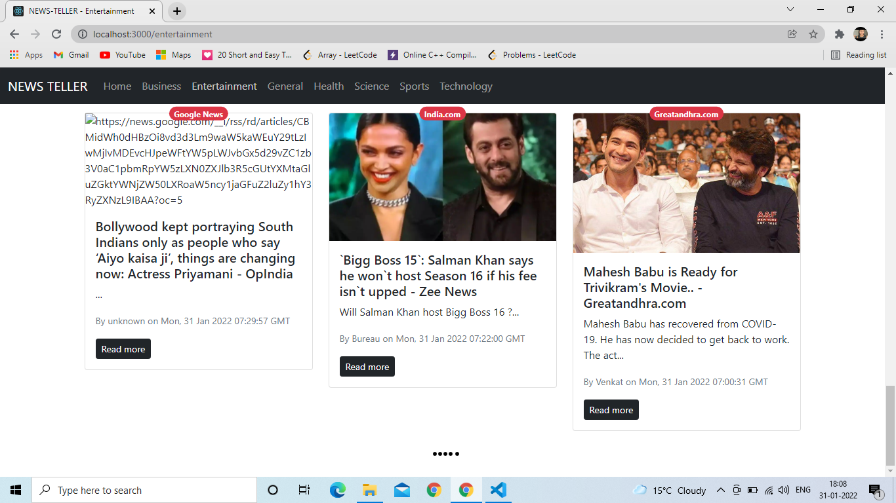

# online_news
This is a web application for reading latest news of diffrent catogories online.
This is made from react with class based components and bootstrap. All the news are fetched from newsAPI and are distributed among diffrent navbar options.

#Explanation

I have made 4 components named as Navbar, News, Newsitem,Spinner
1) Navbar - It consist diffrent news titles and allows us to switch to any category without reloading the page(as ihave imported Link from react-router-dom).
2) Spinner -  It consist a loading gif and it is called inside New.js while fetching the news from newsapi.
3) NewsItem - It is a card component consist information(like heading, news link, related image, date, time, source, author) of a particular news. And this component is called inside News.js  as many times as needed.
4) News - I imported infinityscroll from react-infinite-scroll-component and inside this tag we have fetched news and showed it on web page using NewsItem component. While the news is fetched , Spinner component is called to show the loading(while fetching we make loading true and otherwise make it false and according to loading variable spinner component works.). Url of Api is modified according to category, no. of pages, apikey, country and pagesize.
